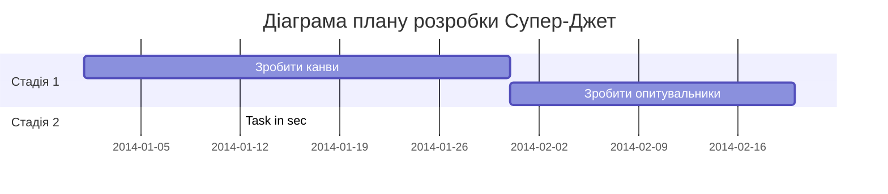

Діаграма необов'язкова, але тут вартувало б подумати що ми хотіли б отримати на виході з семестру? Які етапи для цього потрібні?

# Зустрічі:
> Формат: Дата зустрічі. Учасники. Що зроблено на цю дату. Що домовлено зробити до наступної зустрічі. Додаткові нотатки за потреби.
> Зворотня хронологія, зверху новіші, останні три в картку проєкту

1. [Дата зустрічі 3].
    **Виконано**: Вся команда - Обговорено заявку на грант, переробили самарі і самарі абстракт.
   **Домовлено**: Василь - написати що ми плануємо мати на закінченні гранту, 
   
   
2. [Дата зустрічі 2].
	Виконано: Вся команда - внесені правки в бюджет, експектет ауткам
	Домовлено: Фінальне дозаповнення заявки на грант і подання наступного разу.

3. [Дата зустрічі 1].
	Виконано: подалися на грант, але через те що реченець перенесли на 3 місяці, вирішили взятися за іншу ідею